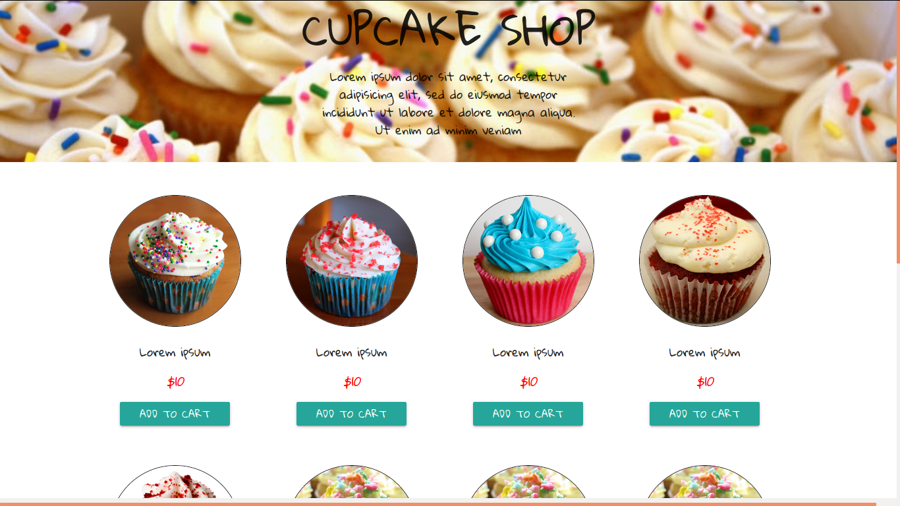

# Cupcake Shop

Front-end project for a cupcake shop built using.

by: [EdwardMudaida](https://edwardmudaida.github.io/)

[view on gh-pages](https://edwardmudaida.github.io/cupcake-shop)

## Technologies used

`HTML5` `CSS` `Materialize.css`

## Running the project:

1. Clone the repo using: `git clone [URL]`

2. Open `index.html in` a browser.

